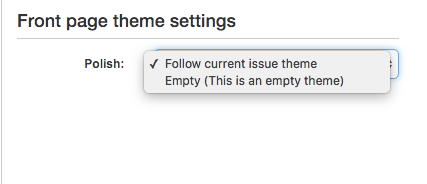

How to make sure the frontpage of a publication always uses the same theme.
---------------------------------------------------------------------------

*Introduced as from Newscoop Version: 4.4.7*

To render pages Newscoop (by default) uses the theme attached to the latest published issue. This behavior works great if you create a new issue per week or month and sometimes you want to use a different theme for special occasions like christmas, easter or elsehow.

But if you don't use issues in the above described way, then it can create problems for a multi theme setup. For example if you use an issues with different themes to organise all articles of a respective region in your publication. In this case the theme being used for the frontpage of the publication would change whenever a new regional issue with a different theme is published.

If in you always want to use the same theme for your frontpage, even if the latest published issue uses a new or different theme, you need to change the publication settings as described below.

  1. Open your publication settings page. In the menu you choose Content->Publications and then you click on the "configure" - pencil icon in the publication list.
  2. Go to "Front page theme settings" and choose which theme should be used for which language on frontpage.

      Please decide to use one of the following options:

      * Follow current issue theme - this will be selected as default - as it's the default Newscoop behaviour.
      * Always use one of the themes assigned to the publication.

  3. Choose the preferred option and save the settings.

